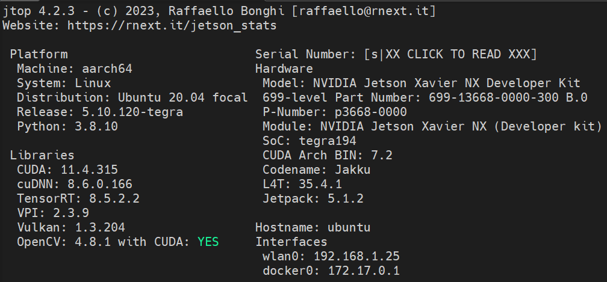
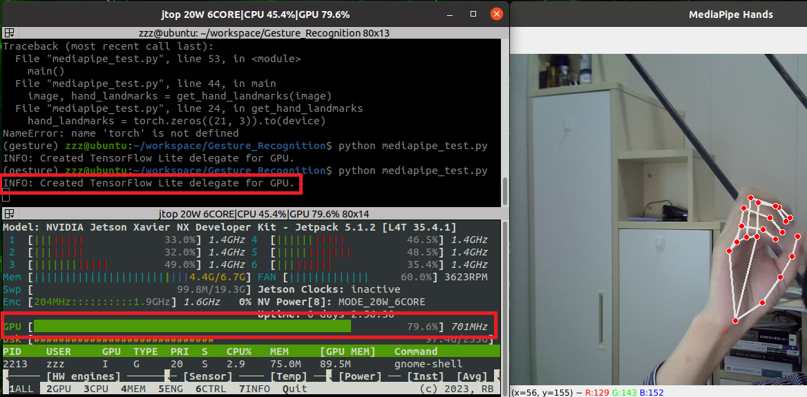

# Mediapipe GPU Support

使用 CPU 版本的 Mediapipe 延迟真的很高，所以试着构建了 GPU 版本的 Mediapipe。

[GPU Support  |  MediaPipe  |  Google for Developers](https://developers.google.com/mediapipe/framework/getting_started/gpu_support)

然而 Google 官方的教程非常过时且并不是针对 Python 包的教程，参考价值非常非常小。因此搜集各路社区论坛，折腾了一个星期终于构建成功。



这个是我构建的环境配置，主要看 CUDA、cuDNN 这两个库还有 Python 的版本（OpenCV 我用 CUDA 编译了 4.8.1 版本不知道有没有啥影响，版本不一样应该可以先不管）。

## 1 安装一些依赖

```bash
sudo apt-get install mesa-common-dev libegl1-mesa-dev libgles2-mesa-dev mesa-utils pkg-config zip g++ zlib1g-dev unzip python3
sudo add-apt-repository ppa:webupd8team/java
sudo apt-get update
sudo apt install openjdk-11-jdk
```

## 2 安装 Bazel

Bazel 是 Google 官方的构建工具，可以在 GitHub 下载。

[Releases · bazelbuild/bazel](https://github.com/bazelbuild/bazel/releases)

我下的是 `6.4.0` 版本的，最新的出了 `7.0.0` 不知道能不能用。

可以直接命令行下载：

```bash
wget https://github.com/bazelbuild/bazel/releases/download/6.4.0/bazel-6.4.0-linux-arm64
chmod +x bazel-6.4.0-linux-arm64
sudo mv bazel-6.4.0-linux-arm64 /usr/local/bin
```

需要放到 `/usr/local/bin` 可以全局使用 `bazel` 命令。

## 3 下载 Mediapipe 源码

[Releases · google/mediapipe](https://github.com/google/mediapipe/releases)

```bash
wget https://github.com/google/mediapipe/archive/refs/tags/v0.10.7.tar.gz
tar -xzvf v0.10.7.tar.gz
cd mediapipe-0.10.7
```

我这里下的是 `v0.10.7` 版本的。

## 4 修改一些源码

参考链接：

[【精选】零基础入门Jetson Nano——MediaPipe双版本（CPU+GPU）的安装与使用_mediapipe gpu加速 如何交叉编译通多的-CSDN博客](https://blog.csdn.net/qq_56548850/article/details/123981579)

[How to compile the gpu version of the python interface · Issue #1042 · google/mediapipe](https://github.com/google/mediapipe/issues/1042#issuecomment-829267239)

1. `./setup.py`

    a. 注释掉下面的语句（注意有两处）：

    ```python
    if not self.link_opencv and not IS_WINDOWS:
        bazel_command.append('--define=OPENCV=source')
    ```

    如果不注释会有如下报错：

    ```
    Error in depset: at index 0 of transitive, got element of type NoneType, want depset
    ```

    b. 替换

    ```python
    binary_graphs = [
    'face_detection/face_detection_short_range_cpu',
    'face_detection/face_detection_full_range_cpu',
    'face_landmark/face_landmark_front_cpu',
    'hand_landmark/hand_landmark_tracking_cpu',
    'holistic_landmark/holistic_landmark_cpu', 'objectron/objectron_cpu',
    'pose_landmark/pose_landmark_cpu',
    'selfie_segmentation/selfie_segmentation_cpu'
    ]
    ```

    为

    ```python
    binary_graphs = [
        'face_detection/face_detection_short_range_gpu',
        'face_detection/face_detection_full_range_gpu',
        'face_landmark/face_landmark_front_gpu',
        'hand_landmark/hand_landmark_tracking_gpu',
        'holistic_landmark/holistic_landmark_gpu', 'objectron/objectron_gpu',
        'pose_landmark/pose_landmark_gpu',
        'selfie_segmentation/selfie_segmentation_gpu'
    ]
    ```

    修改这个是为了构建 gpu 版本的计算图。

    c. 把 `version = 'dev'` 改成 `version = '0.10.7'` 。

2. `./mediapipe/python/solutions`

    可以用 vscode 的搜索替换功能把这个目录下所有文件的的所有 `_cpu.` 替换成 `_gpu.`，例如 `./mediapipe/python/solutions/hands`：

    ```python
    _BINARYPB_FILE_PATH = 'mediapipe/modules/hand_landmark/hand_landmark_tracking_cpu.binarypb'
    ```

    改为
    
    ```python
    _BINARYPB_FILE_PATH = 'mediapipe/modules/hand_landmark/hand_landmark_tracking_gpu.binarypb'
    ``
    
    其它文件的 `_BINARYPB_FILE_PATH` 变量同理。

3. `./mediapipe/python/BUILD`

    ```makefile
    cc_library(
        name = "builtin_calculators",
        deps = [
            "//mediapipe/calculators/core:gate_calculator",
            "//mediapipe/calculators/core:pass_through_calculator",
            "//mediapipe/calculators/core:side_packet_to_stream_calculator",
            "//mediapipe/calculators/core:split_proto_list_calculator",
            "//mediapipe/calculators/core:string_to_int_calculator",
            "//mediapipe/calculators/image:image_transformation_calculator",
            "//mediapipe/calculators/util:detection_unique_id_calculator",
            "//mediapipe/modules/face_detection:face_detection_full_range_cpu",
            "//mediapipe/modules/face_detection:face_detection_short_range_cpu",
            "//mediapipe/modules/face_landmark:face_landmark_front_cpu",
            "//mediapipe/modules/hand_landmark:hand_landmark_tracking_cpu",
            "//mediapipe/modules/holistic_landmark:holistic_landmark_cpu",
            "//mediapipe/modules/objectron:objectron_cpu",
            "//mediapipe/modules/palm_detection:palm_detection_cpu",
            "//mediapipe/modules/pose_detection:pose_detection_cpu",
            "//mediapipe/modules/pose_landmark:pose_landmark_by_roi_cpu",
            "//mediapipe/modules/pose_landmark:pose_landmark_cpu",
            "//mediapipe/modules/selfie_segmentation:selfie_segmentation_cpu",
        ],
    )
    ```

    改为

    ```makefile
    cc_library(
        name = "builtin_calculators",
        deps = [
            "//mediapipe/calculators/core:gate_calculator",
            "//mediapipe/calculators/core:pass_through_calculator",
            "//mediapipe/calculators/core:side_packet_to_stream_calculator",
            "//mediapipe/calculators/core:split_proto_list_calculator",
            "//mediapipe/calculators/core:string_to_int_calculator",
            "//mediapipe/calculators/image:image_transformation_calculator",
            "//mediapipe/calculators/util:detection_unique_id_calculator",
            "//mediapipe/modules/face_detection:face_detection_full_range_gpu",
            "//mediapipe/modules/face_detection:face_detection_short_range_gpu",
            "//mediapipe/modules/face_landmark:face_landmark_front_gpu",
            "//mediapipe/modules/hand_landmark:hand_landmark_tracking_gpu",
            "//mediapipe/modules/holistic_landmark:holistic_landmark_gpu",
            "//mediapipe/modules/objectron:objectron_gpu",
            "//mediapipe/modules/palm_detection:palm_detection_gpu",
            "//mediapipe/modules/pose_detection:pose_detection_gpu",
            "//mediapipe/modules/pose_landmark:pose_landmark_by_roi_gpu",
            "//mediapipe/modules/pose_landmark:pose_landmark_gpu",
            "//mediapipe/modules/selfie_segmentation:selfie_segmentation_gpu",
        ],
    )
    ```

4. `./mediapipe/modules/`

    这里的 gpu 计算图都需要改，但我只用 `hands.py`，所以我只改了`hand_landmark_tracking_gpu.pbtxt` 文件，具体如何修改可以参考：

    [【精选】零基础入门Jetson Nano——MediaPipe双版本（CPU+GPU）的安装与使用_mediapipe gpu加速 如何交叉编译通多的-CSDN博客](https://blog.csdn.net/qq_56548850/article/details/123981579)

    [How to compile the gpu version of the python interface · Issue #1042 · google/mediapipe](https://github.com/google/mediapipe/issues/1042#issuecomment-829267239)

    其它文件的修改也可以参考上面的链接。

5. `./mediapipe/python/solutions/hands.py`

    ```python
    calculator_params={
    	  'palmdetectioncpu__TensorsToDetectionsCalculator.min_score_thresh':
    	      min_detection_confidence,
    	  'handlandmarkcpu__ThresholdingCalculator.threshold':
    	      min_tracking_confidence,
    },
    ```

    改为

    ```python
    calculator_params={
    	  'palmdetectiongpu__TensorsToDetectionsCalculator.min_score_thresh':
    	      min_detection_confidence,
    	  'handlandmarkgpu__ThresholdingCalculator.threshold':
    	      min_tracking_confidence,
    },
    ```

    和 4 是对应的，因为我只需要用这一个应用，所以只改了 `hands.py`，如果要使用其它应用，要把对应的地方改掉。

6. `./mediapipe/framework/tool/BUILD`

    ```makefile
    cc_binary(
        name = "encode_as_c_string",
        srcs = ["encode_as_c_string.cc"],
        visibility = ["//visibility:public"],
        deps = [
            "@com_google_absl//absl/strings",
        ],
    )
    ```

    替换为

    ```makefile
    cc_binary(
        name = "encode_as_c_string",
        srcs = ["encode_as_c_string.cc"],
        visibility = ["//visibility:public"],
        deps = [
            "@com_google_absl//absl/strings",
        ],
        linkopts = ["-lm"],
    )
    ```

    `linkopts = ["-lm"]`，表示在链接阶段将使用 `-lm` 选项，这个选项告诉链接器链接数学库（libm）。

7. `./mediapipe/gpu/gl_context.cc` 和 `./mediapipe/gpu/gl_context_egl.cc`

    注释掉下面的代码：

    ```python
    ABSL_LOG(INFO) << "Successfully initialized EGL. Major : " << major
                   << " Minor: " << minor;
    ```

    ```python
    ABSL_LOG(INFO) << "GL version: " << gl_major_version_ << "."
                   << gl_minor_version_ << " (" << version_string
                   << "), renderer: " << glGetString(GL_RENDERER);
    ```

    为了运行的时候不会打印日志消息。

8. （如果安装了 opencv4）`./third_party/opencv_linux.BUILD`

    ```makefile
    cc_library(
        name = "opencv",
        hdrs = glob([
            # For OpenCV 4.x
            #"include/aarch64-linux-gnu/opencv4/opencv2/cvconfig.h",
            #"include/arm-linux-gnueabihf/opencv4/opencv2/cvconfig.h",
            #"include/x86_64-linux-gnu/opencv4/opencv2/cvconfig.h",
            #"include/opencv4/opencv2/**/*.h*",
        ]),
        includes = [
            # For OpenCV 4.x
            #"include/aarch64-linux-gnu/opencv4/",
            #"include/arm-linux-gnueabihf/opencv4/",
            #"include/x86_64-linux-gnu/opencv4/",
            #"include/opencv4/",
        ],
        linkopts = [
            "-l:libopencv_core.so",
            "-l:libopencv_calib3d.so",
            "-l:libopencv_features2d.so",
            "-l:libopencv_highgui.so",
            "-l:libopencv_imgcodecs.so",
            "-l:libopencv_imgproc.so",
            "-l:libopencv_video.so",
            "-l:libopencv_videoio.so",
        ],
        visibility = ["//visibility:public"],
    )
    ```

    `"include/aarch64-linux-gnu/opencv4/opencv2/cvconfig.h",`

    `"include/aarch64-linux-gnu/opencv4/",`

    取消注释这两行。

    此外，保险起见可以输入下面的命令：

    ```bash
    sudo ln -s /usr/include/opencv4/opencv2 /usr/include/
    ```

    以防动态链接库找不到 opencv2。

## 5 一个和使用虚拟环境有关的问题

参考链接：

[Conda虚拟环境下libp11-kit.so.0: undefined symbol: ffi_type_pointer...问题解决_Destinycjk的博客-CSDN博客](https://blog.csdn.net/qq_38606680/article/details/129118491)

编译时可能会报错：

```bash
ImportError: /lib/aarch64-linux-gnu/libp11-kit.so.0: undefined symbol: ffi_type_pointer, version LIBFFI_BASE_7.0
```

可以看一下虚拟环境 `lib` 中的链接情况

```bash
ls -l ~/miniconda/envs/xxx/lib
# 上面的路径换成你自己的虚拟环境的路径
```


修正链接：

```bash
sudo ln -s /lib/aarch64-linux-gnu/libffi.so.7.1.0 libffi.so.7
sudo ln -s /lib/aarch64-linux-gnu/libffi.so.7.1.0 libffi.7.so
sudo ldconfig
```

## 6 最后配置一下环境变量开始编译

```bash
export http_proxy=http://127.0.0.1:7890
export https_proxy=http://127.0.0.1:7890
# 编译的时候会下载一些第三方库需要开梯子
export TF_CUDA_PATHS=/usr/local/cuda-11.x:/usr/lib/aarch64-linux-gnu:/usr/include
# 上面的 cuda-11.x 需要换成你自己的版本
export MEDIAPIPE_DISABLE_GPU=0
python3 setup.py gen_protos && python3 setup.py bdist_wheel
```

编译完成以后会在 `./dist` 目录下生成 `whl` 文件，`pip` 一下即可。

注意如果中途编译失败可能会导致虚拟环境中 `./envs/xxx/lib/python3.x/site-packages/mediapipe-0.10.7/__init__.py` 出现错误，如下：

```python
from mediapipe.python import *
import mediapipe.python.solutions as solutions 
import mediapipe.tasks.python as tasks

del framework
del gpu
del modules
del python
del mediapipe
del util
__version__ = '0.10.7'

from mediapipe.python import *
import mediapipe.python.solutions as solutions 
import mediapipe.tasks.python as tasks

del framework
del gpu
del modules
del python
del mediapipe
del util
__version__ = '0.10.7'

# ...
```

失败几次就会重复几遍，删去重复内容即可。

遇到这个问题会有如下报错：

```bash
ImportError: cannot import name 'python' from 'mediapipe.tasks.python' (/home/xxx/miniconda3/envs/xxx/lib/python3.8/site-packages/mediapipe/tasks/python/__init__.py)
```

## 7 安装完成

注意，需要先 `import cv2` 再 `import mediapipe as mp` 不然会报错，原因不明 …



可以看到 GPU 版本的 Mediapipe 已经跑起来了，GPU 负荷确实上去了，并且画面延迟和帧率都有不小改善，几乎和没有直接 Capture 的画面一样了。
