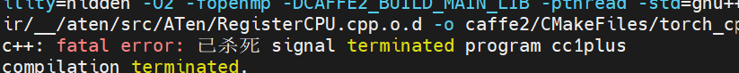
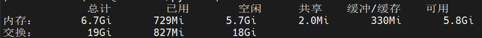

# 从源码编译 PyTorch

1. 从主机 clone 下 `PyTorch` 项目

    ```bash
    git clone --recursive --branch <version> http://github.com/pytorch/pytorch
    cd pytorch
    # if you are updating an existing checkout
    git submodule sync
    git submodule update --init --recursive
    ```

    用 SSH 传输到 Jetson 中

2. 设置编译选项

    ```bash
    export USE_NCCL=0
    # export USE_DISTRIBUTED=0                    # skip setting this if you want to enable OpenMPI backend
    export USE_QNNPACK=0
    export USE_PYTORCH_QNNPACK=0
    export TORCH_CUDA_ARCH_LIST="7.2;8.7"
    export PYTORCH_BUILD_VERSION=<version>  # without the leading 'v', e.g. 1.3.0 for PyTorch v1.3.0
    export PYTORCH_BUILD_NUMBER=1
    ```

    ⚠️ 上面第二行中环境变量 `USE_DISTRIBUTED=0` 和分布式训练有关，可能是跳过了分布式训练相关的编译，这个环境变量也可能为官方给的 `whl` 文件的默认编译配置。报错的位置正好也和 `distributed` 目录下的文件有关，也算是印证了推测。

3. 安装 `ccache` 提高编译速度

    ```bash
    sudo apt install ccache
    ```

4. Build wheel

    ```bash
    sudo apt-get install python3-pip cmake libopenblas-dev libopenmpi-dev
    pip3 install -r requirements.txt
    pip3 install scikit-build
    pip3 install ninja
    python3 setup.py bdist_wheel
    ```

5. 在 build 的过程中遇到编译失败

    

    原因是内存不足，所以尝试增加交换空间，这里增加 16GB

    ```bash
    sudo fallocate -l 16G /swapfile
    sudo chmod 600 /swapfile
    sudo mkswap /swapfile
    # 正在设置交换空间版本 1，大小 = 16 GiB (17179865088  个字节)
    # 无标签， UUID=a00ec274-1174-4211-b875-c11c93326f54
    sudo swapon /swapfile
    ```

    最后检查是否增加成功

    ```bash
    free -h
    ```

    

    在 `/etc/fstab` 下面新加一行可以使得每次开机都会挂载这个交换空间

    ```bash
    /swapfile swap swap defaults 0 0
    ```

6. Build 成功，可以在 `pytorch/dist` 目录下找到 `whl` 文件